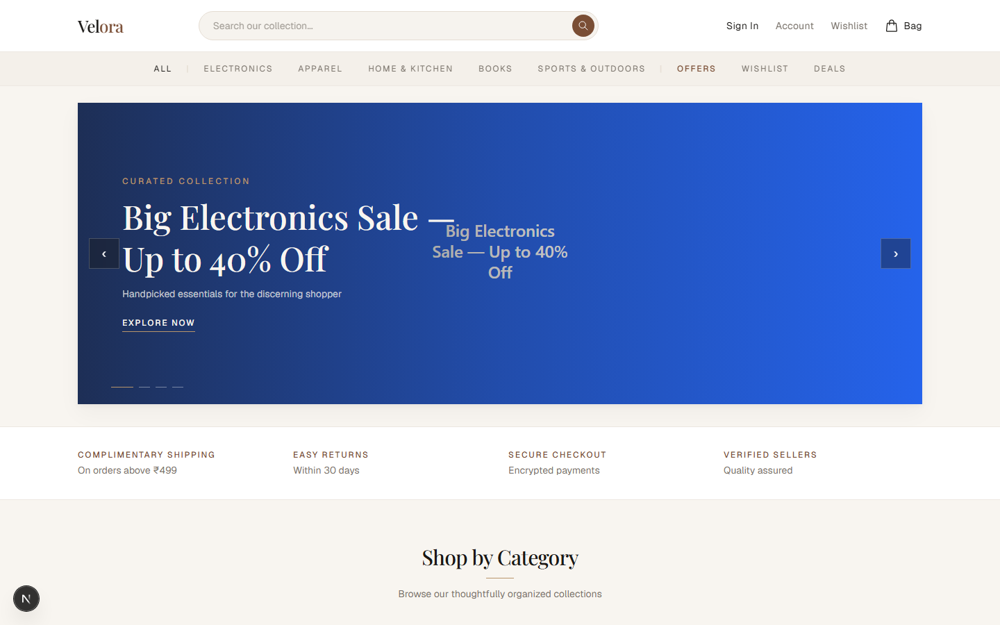
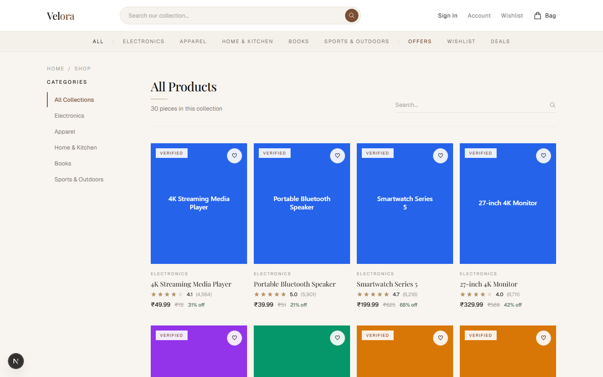
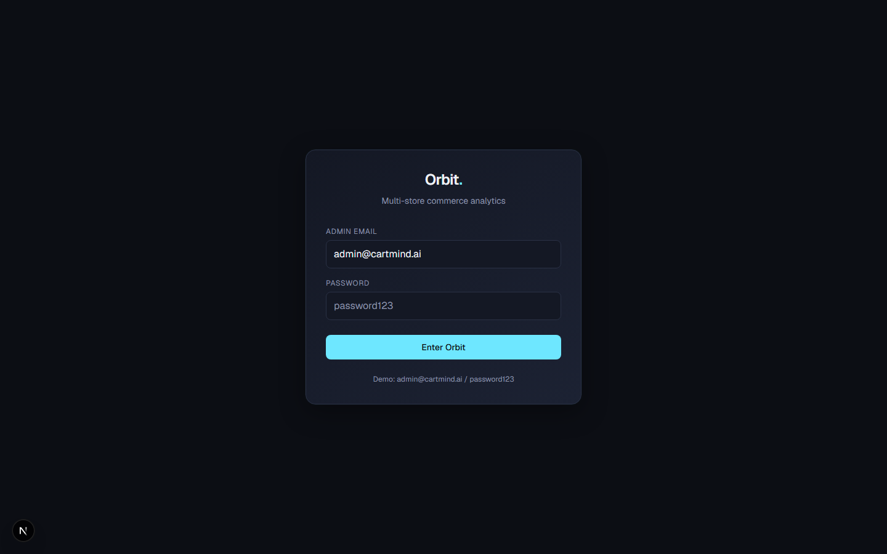
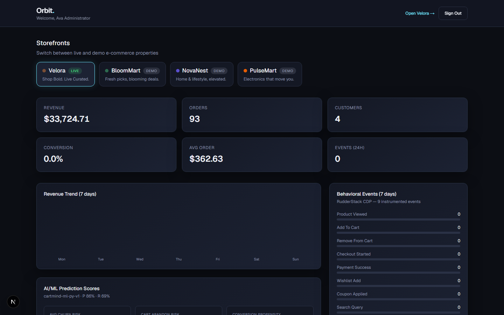
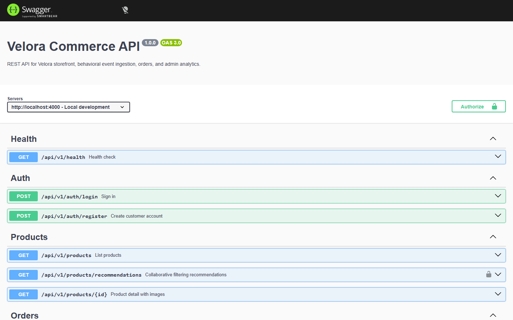
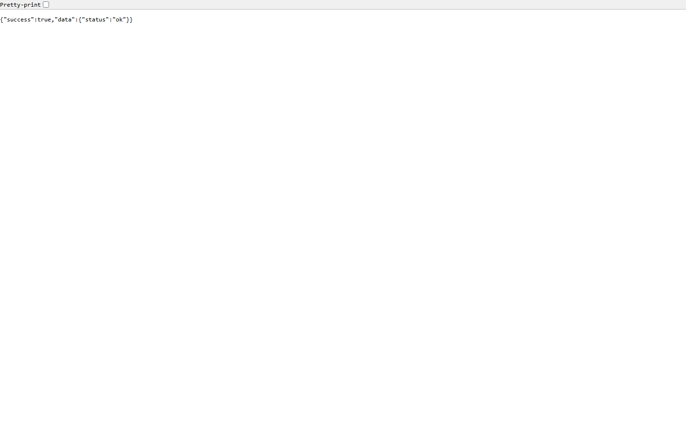
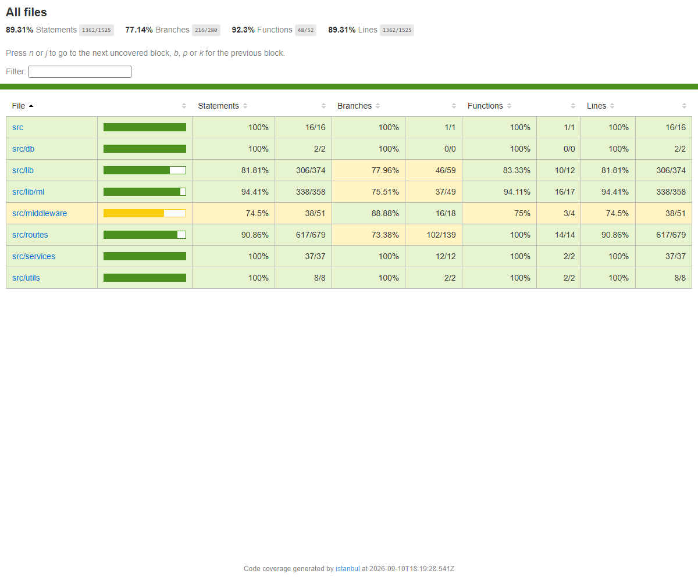

# CartMind AI

**Behavioral-analytics ecommerce platform** — a full shopper journey on **Velora**, first-party event ingestion into PostgreSQL, ML risk scores and segmentation, and operator insights in **Orbit**.

| | |
|--|--|
| **Repo** | [github.com/ShivaSRK2002/CartMind](https://github.com/ShivaSRK2002/CartMind) |
| **Deployed URLs** | Not published yet — run locally (Vercel/Render configs are ready; see [docs/DEPLOYMENT.md](docs/DEPLOYMENT.md)) |

| Surface | Role | Local URL |
|---------|------|-----------|
| **Velora** (`apps/web`) | Customer storefront | http://localhost:3000 |
| **Orbit** (`apps/admin`) | Multi-store analytics admin | http://localhost:3001 |
| **API** (`apps/api`) | Express REST + Swagger | http://localhost:4000 · [docs](http://localhost:4000/api/docs) |

```
Velora (Next.js)  ──►  Express API  ──►  PostgreSQL
Orbit (Next.js)   ──►       ▲
                            │
                     Events + optional RudderStack
```

---

## Screenshots

### Velora storefront





### Orbit dashboard





### API





### Tests & coverage



| Metric | Result |
|--------|--------|
| Tests | **15 passed** (32 todo stubs skipped) |
| Statements | **54.48%** |
| Branches | **63.82%** |
| Functions | **69.38%** |
| Lines | **54.48%** |

Details: [docs/screenshots/COVERAGE.md](docs/screenshots/COVERAGE.md). Re-capture UI shots with apps running: `npm run screenshots`.

---

## What it does

1. **Shop** — Browse, search, wishlist, coupons, cart, multi-step checkout (simulated payment), and order history on Velora.
2. **Track** — Emit nine canonical behavioral events into Postgres (and optionally RudderStack) for every major shopper action.
3. **Analyze** — Orbit shows KPIs, revenue trends, event breakdowns, ML risk scores, k-means cohorts, and an AI insight chat (Google Gemini when configured).

Demo partner stores (**BloomMart**, **NovaNest**, **PulseMart**) appear in Orbit with synthetic dashboards; **Velora** is the live store backed by real DB data.

---

## Monorepo layout

```
cartMindAi/
├── apps/
│   ├── web/                 # Velora — Next.js 16 storefront (App Router)
│   ├── admin/               # Orbit — Next.js 16 analytics dashboard
│   ├── api/                 # Express REST API (auth, catalog, orders, events, ML fallback, Gemini)
│   └── ml/                  # Python ML: scikit-learn/XGBoost models + Databricks medallion pipeline
├── packages/
│   └── shared-types/        # Events, models, coupons, ML types, API envelope
├── db/
│   ├── docker-compose.yml   # PostgreSQL 16
│   └── migrations/          # SQL migrations (node-pg-migrate)
├── docs/
│   ├── DEPLOYMENT.md        # Vercel + Render guide
│   └── screenshots/         # UI + coverage captures for README
├── scripts/
│   └── capture-screenshots.mjs
├── .github/workflows/ci.yml
└── render.yaml              # Render blueprint (API + Postgres)
```

**Workspaces:** npm workspaces (`apps/*`, `packages/*`). Shared contracts live in `cartmind-shared-types`.

---

## Tech stack

| Layer | Stack |
|-------|--------|
| Runtime | Node.js 20, TypeScript |
| Frontends | Next.js 16, React 19, Tailwind CSS 4 |
| API | Express 4, Zod, Swagger UI |
| Auth | JWT (`jsonwebtoken` / `jose`), bcrypt, httpOnly cookies |
| Database | PostgreSQL 16 (`pg`), `node-pg-migrate` |
| Analytics | First-party events + optional RudderStack |
| ML | Python/scikit-learn + XGBoost (`apps/ml`) — real trained models; TS sigmoid/k-means fallback when the pipeline hasn't been run |
| AI insights | Google Gemini REST (optional; rule-based fallback) |
| Deploy | Vercel (web + admin), Render (API + DB), GitHub Actions CI |

---

## High-level flows

### Customer journey (Velora)

```
Browse / search  →  product_viewed
Add to cart / wishlist  →  add_to_cart | wishlist_add
Apply coupon  →  coupon_applied
Checkout  →  checkout_started
Pay (dummy cards)  →  POST /orders  →  payment_success
Leave mid-checkout  →  checkout_abandoned
```

- **Cart, wishlist, coupons** persist in the browser (`localStorage` contexts).
- **Orders** are created on the API after authenticated checkout; payment is simulated via test cards (not a real PSP).
- Next.js BFF routes under `apps/web/app/api/*` proxy to the Express API and attach the session cookie as a Bearer token.

### Event ingestion

```
track*() in storefront
  ├─► POST /api/events (web BFF)  →  POST /api/v1/events  →  PostgreSQL
  └─► RudderStack analytics.track()   (if write key + data-plane URL are set)
```

Session and anonymous IDs are managed client-side. Optional auth attaches `user_id`. Batch ingest is available at `POST /api/v1/events/batch` (max 50).

### Recommendations & ML

| Capability | Behavior |
|------------|----------|
| **Product recommendations** | Item-item collaborative filtering (`apps/ml`, cosine similarity) when trained, blended with purchase history, co-purchase frequency, category affinity, and popularity fallback when sparse |
| **Risk scores** | Churn (Logistic Regression / Random Forest), cart-abandonment & conversion (XGBoost) from `apps/ml`; hand-tuned TS sigmoid ensemble as a no-setup fallback |
| **Segmentation** | K-Means (`apps/ml`, scikit-learn) → `high-value` \| `at-risk` \| `impulse` \| `browser`; seeded TS k-means fallback |
| **Persistence** | `apps/ml` writes to `ml_user_scores`, `ml_product_similarity`, `ml_model_metrics`; TS fallback still summarizes to `analytics_summaries` (model label `velora-ml-v1`) |

See **[apps/ml/README.md](apps/ml/README.md)** for the full pipeline — how the four models map to the use-case doc, the synthetic training approach, and setup/run commands. Latest trained metrics:

| Model | Algorithm | Accuracy | Precision | Recall | ROC-AUC |
|-------|-----------|----------|-----------|--------|---------|
| Churn | Logistic Regression | 80.9% | 86.1% | 69.4% | **88.3%** |
| Cart abandonment | XGBoost | **84.6%** | 85.4% | 98.6% | 76.6% |
| Conversion | XGBoost | 82.5% | 78.2% | 77.4% | 91.7% |

(Trained on synthetic data — see `apps/ml/src/cartmind_ml/synthetic.py` — then applied to the live Velora database. Re-run `npm run ml:pipeline` to refresh.)

### Databricks pipeline (the `PostgreSQL → Databricks` stage)

`apps/ml/databricks/` is a Bronze → Silver → Gold PySpark medallion pipeline
built for **Databricks Free Edition** (serverless — no cluster to create).
It turns the raw behavioral tables into Gold feature/analytics tables:

| Gold table | Feeds |
|------------|-------|
| `gold_user_features` | the Python ML engine — `score.py` reads it from `ml_user_features` when present, else falls back to its own live SQL aggregate |
| `gold_revenue_daily`, `gold_event_funnel` | the Databricks AI/BI dashboard (12 widgets, published) |
| `gold_product_interactions` | the recommendation engine's interaction matrix |

Free Edition can't reach a local DB or schedule JDBC jobs, so it's a file
round-trip: `npm run ml:export` → upload the parquet to a Unity Catalog
Volume → run the notebook → download the Gold CSV → `npm run ml:load-gold -- --features <csv>` → `npm run ml:score`. The same transform runs locally (`npm run ml:medallion`) and, unchanged, as a scheduled JDBC Job on a paid workspace.

A **published 12-widget Databricks AI/BI dashboard** ("CartMind") sits on the Gold tables — KPIs, revenue trend, conversion funnel, event mix, customer segmentation, top products. Full walkthrough + dashboard SQL: **[apps/ml/databricks/README.md](apps/ml/databricks/README.md)**.

### Orbit insights

Admin JWT → store dashboard (live for Velora, demo for others) → optional `POST /api/v1/admin/insights/chat`. With `GEMINI_API_KEY`, replies use Gemini; otherwise a keyword rule-based assistant responds.

### Authentication

- API issues JWTs on register/login; Velora and Orbit store them in **httpOnly** cookies via their own BFF auth routes.
- **`JWT_SECRET` must be identical** across `apps/api`, `apps/web`, and `apps/admin`.
- Register always creates a `customer`. Orbit login rejects non-admin users.
- Seeded: `admin@cartmind.ai` and customers `alice|bob|carol|dave@example.com` — password `password123` for all.

---

## Canonical behavioral events

Do not rename these (shared in `packages/shared-types/src/events.ts`):

| Event | When |
|-------|------|
| `product_viewed` | Product detail / listing interest |
| `add_to_cart` | Line added to cart |
| `remove_from_cart` | Line removed |
| `checkout_started` | Checkout entered |
| `payment_success` | Order paid successfully |
| `wishlist_add` | Item saved to wishlist |
| `coupon_applied` | Promo code applied |
| `search_query` | Catalog search |
| `checkout_abandoned` | Checkout left incomplete |

---

## API surface

Base path: `/api/v1`. Interactive docs: `/api/docs`.

| Group | Endpoints |
|-------|-----------|
| Health | `GET /health` |
| Auth | `POST /auth/register`, `POST /auth/login`, `GET /auth/me` |
| Banners | `GET /banners` |
| Products | `GET /products`, `GET /products/recommendations`, `GET /products/:id` |
| Orders | `POST /orders`, `GET /orders/me`, `GET /orders/:id` |
| Events | `POST /events`, `POST /events/batch` |
| Admin | `GET /admin/stores`, `GET /admin/customers`, `GET /admin/dashboard/:storeId`, `POST /admin/insights/chat` |

Responses use the shared envelope: `{ success, data }` or `{ success: false, error }`.

---

## Velora & Orbit pages

### Velora (`apps/web`)

| Route | Purpose |
|-------|---------|
| `/` | Home — banners, categories, product rows |
| `/products`, `/products/[id]` | Catalog + detail (gallery, cart, wishlist, recommendations) |
| `/cart` | Cart quantities, subtotal, coupon field |
| `/checkout`, `/checkout/confirmation` | Multi-step checkout + confirmation |
| `/wishlist` | Saved items |
| `/offers` | Demo promo codes |
| `/login`, `/register` | Customer (and admin redirect toward Orbit) |
| `/account`, `/account/orders`, `/account/orders/[id]` | Profile and order history |

### Orbit (`apps/admin`)

| Route | Purpose |
|-------|---------|
| `/login` | Admin-only sign-in |
| `/` | Store selector, KPIs, revenue chart, events, segmentation, ML scores, customers, AI insight panel |

---

## Prerequisites

- Node.js 20 (see `.nvmrc`)
- npm 10+
- Docker Desktop (or Docker Engine + Compose) for local PostgreSQL
- Python 3.11+ (optional — only needed to run the real ML pipeline in `apps/ml`; the app works without it, using the TS fallback scorer)

---

## Getting started

```bash
npm install

cp apps/web/.env.example apps/web/.env.local
cp apps/admin/.env.example apps/admin/.env.local
cp apps/api/.env.example apps/api/.env
cp db/.env.example db/.env

docker compose -f db/docker-compose.yml up -d
npm run db:migrate
npm run db:seed
npm run dev
```

| Script | Action |
|--------|--------|
| `npm run dev` | Velora :3000, Orbit :3001, API :4000 |
| `npm run dev:web` / `dev:api` / `dev:admin` | Run one app |
| `npm run db:migrate` | Apply SQL migrations |
| `npm run db:seed` | Demo users, 30 products, banners, order history |
| `npm run build` / `lint` / `test` | Workspace-wide |
| `npm run ml:pipeline` | Train + score the Python ML pipeline (see [apps/ml/README.md](apps/ml/README.md) for setup) |
| `npm run ml:export` / `ml:medallion` | Export raw tables for Databricks / run the medallion transform locally ([apps/ml/databricks/README.md](apps/ml/databricks/README.md)) |

Postgres defaults: `localhost:5432`, user/password/db `cartmind` / `cartmind` / `cartmind`.

Health check: `GET http://localhost:4000/api/v1/health`

### Seed highlights

- 5 users (1 admin + 4 customers), password `password123`
- 30 products across 5 categories (SVG placeholders by category — no external image CDN)
- Promo banners and ~20–30 dated orders per customer
- Safe to re-run (truncates dependent tables first)

Rollback last migration: `npm run migrate:down --workspace=apps/api`

---

## Environment variables

### API (`apps/api/.env`)

| Variable | Purpose |
|----------|---------|
| `PORT` | Default `4000` |
| `DATABASE_URL` | Postgres connection string |
| `JWT_SECRET` | Token signing (must match frontends) |
| `GEMINI_API_KEY` | Optional Orbit AI chat |
| `GEMINI_MODEL` | Default `gemini-2.0-flash` |
| `RUDDERSTACK_WRITE_KEY` / `RUDDERSTACK_DATA_PLANE_URL` | Optional server CDP |

### Velora (`apps/web/.env.local`)

| Variable | Purpose |
|----------|---------|
| `NEXT_PUBLIC_API_URL` | Express base URL |
| `NEXT_PUBLIC_ADMIN_URL` | Orbit URL (default `:3001`) |
| `NEXT_PUBLIC_RUDDERSTACK_*` | Browser CDP |
| `JWT_SECRET` | Verify session cookie |

### Orbit (`apps/admin/.env.local`)

| Variable | Purpose |
|----------|---------|
| `NEXT_PUBLIC_API_URL` | Express base URL |
| `JWT_SECRET` | Verify admin session cookie |

---

## Testing

```bash
# Unit-focused (no DB required for many cases)
npm run test --workspace=apps/api -- --testNamePattern="health|predict|coupons"

# Full suite + coverage (requires Postgres + seed)
npm run db:migrate && npm run db:seed
npm run test:coverage
```

Latest captured metrics (also in [docs/screenshots/COVERAGE.md](docs/screenshots/COVERAGE.md)): **15 passed**, **54.48%** line coverage.

CI (`.github/workflows/ci.yml`) on push/PR: install, build shared types, migrate/seed Postgres, build apps, API integration tests, lint.

---

## Deployment

See **[docs/DEPLOYMENT.md](docs/DEPLOYMENT.md)** for end-to-end setup.

| Component | Target |
|-----------|--------|
| Velora | Vercel project, root directory `apps/web` |
| Orbit | Vercel project, root directory `apps/admin` |
| API + Postgres | Render via `render.yaml` (`apps/api/Dockerfile`) |

After Render deploy, run migrate + seed in the service shell and set `GEMINI_API_KEY` if you want live AI insights. Point both frontends at `NEXT_PUBLIC_API_URL=https://your-api.onrender.com`.

---

## Database schema (migrations)

| Migration | Contents |
|-----------|----------|
| `0001_init` | Users, products, orders, order items |
| `0002_events` | Event type ENUM + events table |
| `0003_analytics_summaries` | ML / KPI rollups |
| `0004_banners` | Promo banners |
| `0005_product_images` | Product gallery images |
| `0006_ml_pipeline` | `ml_user_scores`, `ml_product_similarity`, `ml_model_metrics` (written by `apps/ml`) |
| `0007_ml_features` | `ml_user_features` — Gold feature landing zone from the Databricks pipeline |

---

## Notable product features

- **Demo coupons** — e.g. `VELORA10`, `FUNKY50`, `WELCOME15` (`packages/shared-types/src/coupons.ts`)
- **Recommendations** — collaborative + category heuristics on the products API
- **ML pipeline** — churn / abandonment / conversion scores + four behavioral cohorts
- **Gemini insights** — natural-language Q&A over dashboard context in Orbit
- **Multi-store Orbit** — one live store (Velora) + three demo dashboards
- **Dual-write analytics** — first-party Postgres always; RudderStack when configured
)
